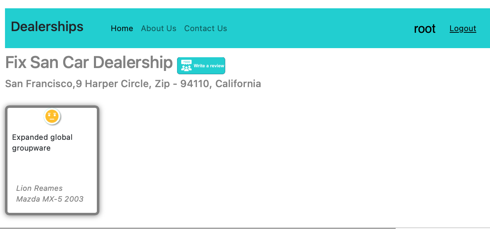

# CarDealership Review Web application
This repository contains the code for a cloud-hosted Django web application designed for a fictional car dealership where users can add review for any car models and dealerships.

## Technologies used
- Django
- Javascript
- Python
- HTML & CSS
  
## Demo
Landing page will allow users to login or register new account  
  
New users can then register and login  
  
Once logged in, all car dealerships are shown  
  
Users can view selected dealership and add review  
  
  
Once added, new review is shown  
  
Users can also click on other tab to view other information such as Contact us  
  

## Disclaimer
This project was developed as part of the IBM Full Stack Software Developer course.
